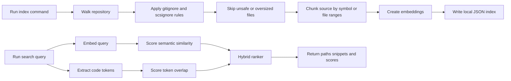

# Semantic Code Search

Semantic Code Search is a TypeScript CLI for indexing a local repository and finding code by meaning, not just by exact text. It combines OpenAI embeddings with code-token overlap so a query like "where invoices are deduplicated" can surface relevant functions, classes, file chunks, and snippets even when the code uses different wording.

Use `--provider hash` for deterministic offline demos and tests, or use the default OpenAI provider for real semantic search over your own codebase.

## Who It Is For

- Engineers joining an unfamiliar repository who need to find the right entry points quickly.
- Maintainers planning refactors who need to trace related code across files and naming conventions.
- Staff and platform engineers reviewing ownership boundaries, hidden coupling, or repeated patterns.
- Tech leads answering implementation questions without building a full hosted code intelligence stack.
- AI-assisted development workflows that need a local, inspectable code index before asking for changes.

## Real-World Use Cases

- Onboarding: search for "where login sessions are refreshed" or "how invoices are imported" before reading every route and service.
- Refactoring: find chunks related to "legacy CSV parsing", "retry policy", or "permission checks" even when the identifiers are inconsistent.
- Incident response: locate the code path for "webhook signature validation" or "background job dead letter handling" under time pressure.
- Architecture review: inspect how a domain concept appears across CLI commands, services, tests, and shared utilities.
- Pairing with AI tools: create a focused local index, search it, then pass only the relevant files and snippets into a coding session.

## How It Works



### Indexing

`semantic-code-search index` walks a local codebase, applies built-in safety exclusions, reads `.gitignore` and `.scsignore`, skips binary files, ignores symlinks, enforces file and total byte limits, and writes a portable JSON index to `.semantic-code-search/index.json` by default.

The OpenAI provider embeds chunk text with `text-embedding-3-small` unless `OPENAI_EMBEDDING_MODEL` or `--model` overrides it. The hash provider creates deterministic local embeddings for tests, examples, and offline evaluation.

### Chunking

The chunker looks for common source structures such as TypeScript and JavaScript classes/functions/arrow functions, Python `def`, and Go `func` declarations. When it finds symbols, it stores symbol-level chunks with file path, line range, language, content hash, and token count. Files without recognized symbols fall back to bounded line-range chunks.

### Ranking

Search uses a hybrid score:

- Semantic score: cosine similarity between the query embedding and each chunk embedding, normalized to a 0 to 1 range.
- Token score: overlap between query tokens and code/path/symbol tokens, with small boosts for symbol and path matches.
- Final score: weighted blend of both signals. The default semantic weight is `0.72`; change it with `--semantic-weight`.

This keeps natural-language matching useful while still rewarding exact names, paths, and domain terms.

## Setup

Requirements:

- Node.js 20 or newer
- npm
- An OpenAI API key for real embedding and AI explanation calls

Install dependencies:

```bash
npm install
```

Create local configuration:

```bash
cp .env.example .env.local
```

Set `OPENAI_API_KEY` in `.env.local` if you use `--provider openai` or `explain --ai`. Do not commit `.env.local`.

For offline testing or demos, skip the API key and pass `--provider hash`.

## Commands

Build the CLI:

```bash
npm run build
```

Index the current repository with OpenAI embeddings:

```bash
npx semantic-code-search index . --out .semantic-code-search/index.json
```

Index without network calls:

```bash
npx semantic-code-search index . --provider hash --out .semantic-code-search/index.json
```

Search an existing index:

```bash
npx semantic-code-search search "where invoices are deduplicated" --index .semantic-code-search/index.json
```

Return JSON results:

```bash
npx semantic-code-search search "retry failed webhooks" --json
```

Explain a result locally:

```bash
npx semantic-code-search explain "where invoices are deduplicated" --rank 1
```

Ask an OpenAI model for a concise explanation:

```bash
npx semantic-code-search explain "where invoices are deduplicated" --rank 1 --ai
```

Start the local web UI:

```bash
npx semantic-code-search serve --index .semantic-code-search/index.json
```

## Development Commands

```bash
npm run typecheck
npm test
npm run build
npm run deps:audit
npm run deps:outdated
```

`npm run deps:audit` fails on vulnerabilities at moderate severity or higher. `npm run deps:outdated` fails when npm reports outdated direct dependencies.

## Configuration

`.env.example` documents the supported local environment variables:

| Variable | Required | Purpose |
| --- | --- | --- |
| `OPENAI_API_KEY` | For OpenAI embeddings and `--ai` explanations | API key used by the OpenAI SDK. |
| `OPENAI_EMBEDDING_MODEL` | No | Embedding model override. Defaults to `text-embedding-3-small`. |
| `OPENAI_EXPLAIN_MODEL` | No | Responses API model used by `explain --ai`. |

Runtime flags can override index output, provider, model, dimensions, chunk size, byte limits, search limit, ranking weight, server host, and server port. Run command-specific help for the full option list:

```bash
npx semantic-code-search index --help
npx semantic-code-search search --help
npx semantic-code-search explain --help
npx semantic-code-search serve --help
```

## Codebase Structure

| Path | Purpose |
| --- | --- |
| `src/cli.ts` | Commander-based CLI for `index`, `search`, `explain`, and `serve`. |
| `src/walker.ts` | Safe repository traversal with size limits, binary detection, and ignore handling. |
| `src/ignore-rules.ts` | Built-in ignore rules plus `.gitignore` and `.scsignore` loading. |
| `src/chunker.ts` | Source chunking by recognized symbols or bounded file ranges. |
| `src/embeddings.ts` | OpenAI and deterministic hash embedding providers. |
| `src/indexer.ts` | Index creation and query embedding resolution. |
| `src/ranking.ts` | Cosine similarity, code-token scoring, snippets, and hybrid ranking. |
| `src/index-store.ts` | JSON index schema validation, reading, and writing. |
| `src/explain.ts` | Local and OpenAI-backed result explanations. |
| `src/server.ts` | Local-only HTTP UI and search API. |
| `tests/` | Vitest coverage for chunking, ignore rules, ranking, index storage, and CLI behavior. |

## Privacy And Security

- The index is local by default and is written under `.semantic-code-search/`, which is ignored by git.
- The generated index contains source snippets and embeddings. Treat it as sensitive if the indexed repository is private.
- With `--provider openai`, indexed chunk text and search queries are sent to the configured OpenAI API. Use `--provider hash` when you need fully local deterministic behavior.
- Use `.gitignore` or `.scsignore` to exclude secrets, generated artifacts, vendored dependencies, private notes, and large files from indexing.
- `.env.local` is ignored by git. Keep API keys there or in your shell environment, never in tracked files.
- The web UI binds to `127.0.0.1` by default and is intended for local use.

## Dependency Maintenance

Dependabot is configured for npm packages and GitHub Actions. CI installs with `npm ci`, runs the moderate-level audit, checks for outdated dependencies, typechecks, tests, and builds.
