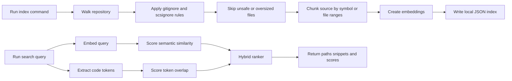

# Architecture

Semantic Code Search indexes a local repository into a JSON file of chunks and
embeddings, then ranks queries with a blend of embedding similarity and code-token
overlap.

Diagram source: [architecture.mmd](architecture.mmd).

## Indexing

`semantic-code-search index` walks a local codebase, applies built-in safety exclusions,
reads `.gitignore` and `.scsignore`, skips binary files, ignores symlinks, enforces file
and total byte limits, and writes a portable JSON index to
`.semantic-code-search/index.json` by default.

The OpenAI provider embeds chunk text with `text-embedding-3-small` unless
`OPENAI_EMBEDDING_MODEL` or `--model` overrides it. The hash provider creates
deterministic local embeddings for tests, examples, and offline evaluation.

## Chunking

The chunker looks for common source structures such as TypeScript and JavaScript
classes/functions/arrow functions, Python `def`, and Go `func` declarations. When it
finds symbols, it stores symbol-level chunks with file path, line range, language,
content hash, and token count. Files without recognized symbols fall back to bounded
line-range chunks.

## Ranking

Search uses a hybrid score:

- Semantic score: cosine similarity between the query embedding and each chunk embedding, normalized to a 0 to 1 range.
- Token score: overlap between query tokens and code/path/symbol tokens, with small boosts for symbol and path matches.
- Final score: weighted blend of both signals. The default semantic weight is `0.72`; change it with `--semantic-weight`.

This keeps natural-language matching useful while still rewarding exact names, paths,
and domain terms.

## Modules

| Path | Purpose |
| --- | --- |
| `src/cli.ts` | Commander-based CLI for `index`, `search`, `explain`, and `serve`. |
| `src/walker.ts` | Safe repository traversal with size limits, binary detection, and ignore handling. |
| `src/ignore-rules.ts` | Built-in ignore rules plus `.gitignore` and `.scsignore` loading. |
| `src/chunker.ts` | Source chunking by recognized symbols or bounded file ranges. |
| `src/embeddings.ts` | OpenAI and deterministic hash embedding providers. |
| `src/indexer.ts` | Index creation and query embedding resolution. |
| `src/ranking.ts` | Cosine similarity, code-token scoring, snippets, and hybrid ranking. |
| `src/index-store.ts` | JSON index schema validation, reading, and writing. |
| `src/explain.ts` | Local and OpenAI-backed result explanations. |
| `src/server.ts` | Local-only HTTP UI and search API. |
| `tests/` | Vitest coverage for chunking, ignore rules, ranking, index storage, and CLI behavior. |
